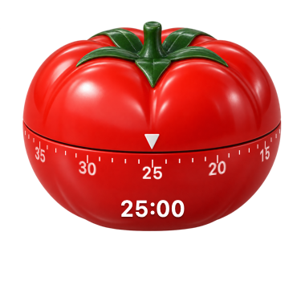

# Tomato Timer

A tiny floating tomato-shaped Pomodoro timer for macOS, with an animated dial and mechanical alarm.



## Install

[Download Tomato-Timer.dmg](https://github.com/gwshay/tomato-timer/releases/latest/download/Tomato-Timer.dmg), open it, and drag Tomato Timer into Applications. A simple guide appears on first launch.

Includes Apple silicon and Intel builds targeting macOS 13 or later. No extra dependencies or account required.

This personal build is not Developer ID signed or notarized. If macOS blocks it and you trust the download, open System Settings → Privacy & Security → Open Anyway after attempting to launch it. [Apple’s instructions](https://support.apple.com/102445).

## Controls

- Double-click to start, pause, or resume.
- Drag to move.
- Right-click for custom time, sound and volume, desktop placement, and the quick guide.
- Use the menu bar timer icon to bring it forward or quit.

Focus for 25 minutes, then double-click to start a 5-minute break when the alarm rings. Custom times support minutes or minutes:seconds, from 0:01 to 180:00. Sessions wait for you to start the next one.

The rotating dial follows the countdown. Choose a mechanical bell alarm or an original synthesized retro spaceship sound. Volume and timer state are saved. Running timers include elapsed time while asleep or closed; an alarm missed then is reported when the app next runs.

## Build

Requires Apple’s Swift command-line tools on a Mac:

```sh
bash build.sh
"Tomato Timer.app/Contents/MacOS/TomatoTimer" --self-test
```

The build produces a universal, locally signed app. Intel and older macOS runtime behavior has not been tested on physical hardware; the current Apple silicon build and timer logic have been checked.
